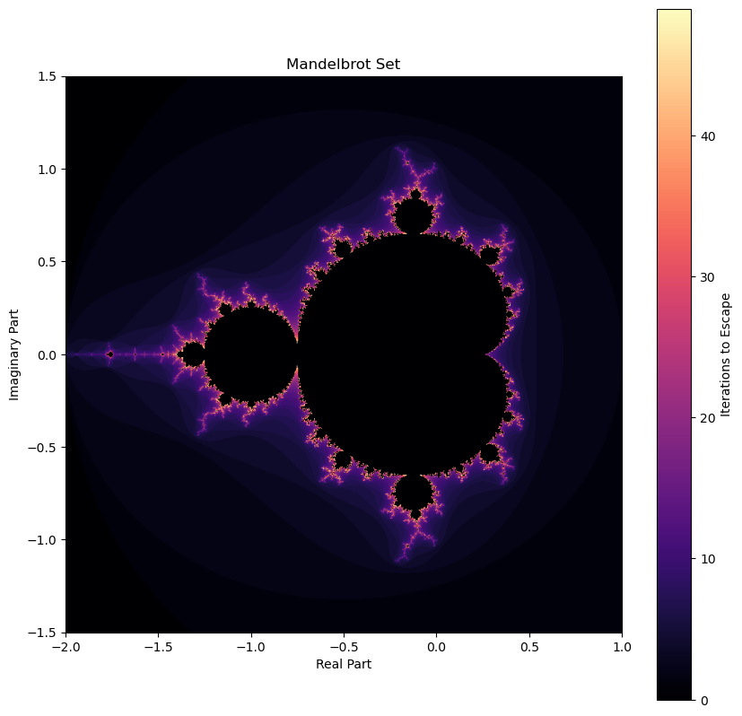

# Mandelbrot Set
This Jupyter Notebook demonstrates the Mandelbrot Set,  famous fractal in complex dynamics, using Python. It creates a grid of complex numbers, iterates the Mandelbrot equation for each point, and records how quickly each point "escapes" to infinity. The result is displayed as an image, where colors represent the number of iterations before escape.

---

## Table of Contents
- [Overview](#overview)
- [Requirements](#requirements)
- [Installation](#installation)
- [Usage](#usage)
- [Example / Screenshots](#example--screenshots)
- [How It Works](#how-it-works)
- [License](#license)

---

## Overview
This notebook:
- Creates a 2D grid of complex numbers representing points in the complex plane.
- Iterates the Mandelbrot equation `z = z**2 + c` for each point.
- Records how quickly each point "escapes" beyond a certain threshold.
- Visualizes the results with colors representing iteration counts, revealing the fractal structure.

---

## Requirements
- python==3.11.11
- matplotlib==3.10.0
- numpy==1.26.4

## Installation
git clone https://github.com/mnmarinaccio/MandelbrotSet.git  
cd MandelbrotSet

You can install the dependencies with:  
pip install -r requirements.txt

## Usage
Open the notebook in Jupyter and run all cells  
jupyter notebook MandelbrotSet.ipynb

## Example / Screenshots

## How It Works

1. **Grid Setup**
   - Define a rectangular region of the complex plane.
   - Sample points on a 2D grid representing complex numbers.

2. **Iteration**
   - For each point `c`, initialize `z = 0`.
   - Iterate `z = z**2 + c` up to a maximum number of iterations.

3. **Escape Detection**
   - Track when `|z|` exceeds the escape radius (usually 2).
   - Points that escape quickly are recorded with lower iteration counts, while points that remain bounded get the maximum iteration count.

4. **Visualization**
   - Use `matplotlib` to map iteration counts to colors.
   - Darker regions correspond to points that take longer to escape.
   - Display the fractal image showing the Mandelbrot set.
## License
This project is licensed under the Apache 2.0 License. See the LICENSE file for details.
